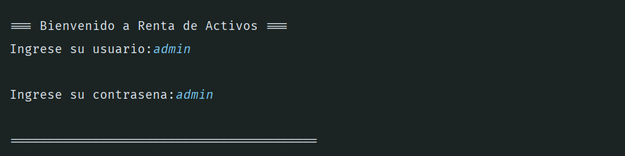
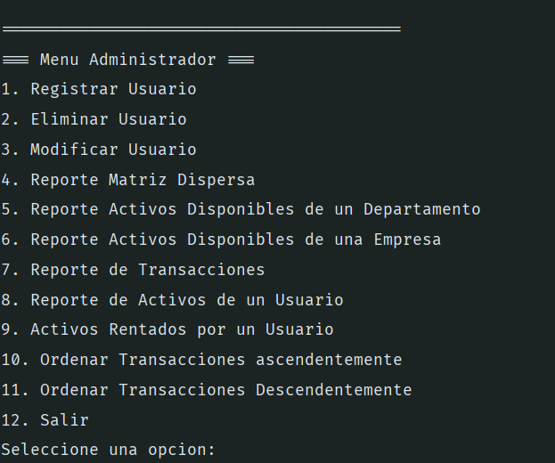
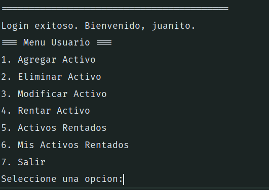
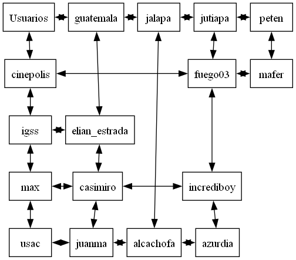

# Manual de Usuario del Sistema de Gestión de Activos

## Introducción

Este manual está diseñado para proporcionar una guía clara y concisa sobre el funcionamiento del **Sistema de Gestión de Activos**. El programa facilita la gestión de usuarios, empresas, departamentos y activos, utilizando estructuras avanzadas como matrices dispersas y árboles AVL. Además, cuenta con menús específicos para administradores y usuarios normales.

## Requisitos del Sistema
- **Sistema Operativo**: Windows, Linux.
- **Compilador**: GCC (GNU Compiler Collection).
- **Herramientas**: Graphviz (para visualización de estructuras).
- **Almacenamiento**: 10 MB de espacio en disco.
---

## Objetivo del Sistema
El objetivo principal del programa es proporcionar un sistema eficiente para gestionar activos empresariales y usuarios asociados. Las características principales incluyen:

- **Autenticación de usuarios** (administradores y usuarios normales).
- **Gestión de activos** mediante árboles AVL.
- **Organización de datos** a través de una matriz dispersa.
- **Graficación de estructuras** con herramientas como Graphviz.
- **Manejo de transacciones** mediante listas circulares doblemente enlazadas.

---
## 1. Inicio de Sesión

### Funcionalidad:
El sistema diferencia entre dos tipos de usuarios:
- **Administrador**: Tiene acceso a funcionalidades avanzadas como gestión de usuarios, empresas y activos.
- **Usuario Normal**: Puede acceder a funcionalidades básicas como consulta de activos y registro de transacciones.

### Procedimiento:
1. Al ejecutar el programa, aparecerá una pantalla de inicio de sesión.
2. Ingrese su **nombre de usuario** y **contraseña**.
3. Según su tipo de usuario, accederá al menú correspondiente.

---

## 2. Menú de Administrador

### Opciones Disponibles:
El administrador tiene acceso a las siguientes funcionalidades:

1. **Gestión de Usuarios**:
    - Registrar nuevos usuarios.
    - Eliminar usuarios existentes.
    - Actualizar información de usuarios.

2. **Gestión de Empresas y Departamentos**:
    - Registrar nuevas empresas y departamentos.
    - Consultar y eliminar elementos existentes.

3. **Gestión de Activos**:
    - Registrar activos.
    - Modificar información de activos.
    - Eliminar activos obsoletos.
    - Visualizar activos en una estructura de árbol AVL.

4. **Graficar Estructuras**:
    - Visualización de la **matriz dispersa** con los departamentos y empresas.
    - Visualización del **árbol AVL** de activos.
    - Generación de archivos DOT compatibles con **Graphviz**.

5. **Reportes de Transacciones**:
    - Consultar registros de transacciones.
    - Visualización de transacciones a través de la lista circular doblemente enlazada.

6. **Salir del Sistema**:
    - Cierra la sesión actual y finaliza el programa.

---

## 3. Menú de Usuario Normal

### Opciones Disponibles:
El usuario normal tiene acceso a las siguientes funcionalidades:

1. **Consulta de Activos**:
    - Visualización de activos registrados en el sistema.

2. **Registro de Transacciones**:
    - Registrar transacciones relacionadas con activos específicos.
    - Las transacciones quedan almacenadas en la lista circular doblemente enlazada.

3. **Graficar Estructuras**:
    - Visualización de la **matriz dispersa** y árbol AVL relacionados con sus activos disponibles.

4. **Salir del Sistema**:
    - Cierra la sesión actual y finaliza el programa.

---

## 4. Estructuras y Visualización
El sistema utiliza estructuras avanzadas para organizar y representar los datos de manera eficiente:

1. **Matriz Dispersa**:
    - Organiza los activos según **Empresas** y **Departamentos**.
    - Los encabezados representan las filas (Departamentos) y columnas (Empresas).

2. **Árbol AVL**:
    - Almacena los activos de forma ordenada.
    - Permite operaciones eficientes de inserción, búsqueda y eliminación.

3. **Lista Circular Doblemente Enlazada**:
    - Maneja el registro de transacciones.
    - Facilita la navegación circular entre registros.

4. **Graphviz**:
    - Se utiliza para generar representaciones gráficas de la **matriz dispersa** y del **árbol AVL**.

### Cómo Visualizar las Estructuras:
- Seleccione la opción **"Graficar Estructuras"** desde el menú.
- Se generarán archivos `.dot` que pueden visualizarse utilizando la herramienta **Graphviz**.

---

## 5. Salida del Programa

### Procedimiento:
1. En cualquier menú, seleccione la opción **"Salir del Sistema"**.
2. El programa cerrará la sesión actual y finalizará.

---

## Recomendaciones de Uso
- Asegúrese de ingresar correctamente su **nombre de usuario** y **contraseña**.
- Solo los administradores pueden realizar modificaciones en los usuarios, empresas y activos.
- Utilice la opción de graficación para verificar la integridad de las estructuras de datos.

---

## Resolución de Problemas

| Problema                      | Solución                                  |
|-------------------------------|------------------------------------------|
| No puedo iniciar sesión       | Verifique que el nombre y la contraseña sean correctos. |
| No se visualiza la gráfica    | Asegúrese de tener instalado Graphviz y configure los archivos DOT correctamente. |
| No se encuentran transacciones| Revise si se han registrado transacciones en el sistema. |

---

## Conclusión
El **Sistema de Gestión de Activos** proporciona una solución eficiente y ordenada para manejar grandes cantidades de información relacionada con usuarios, empresas, departamentos y activos. Si sigue las instrucciones de este manual, podrá navegar por todas las funcionalidades del sistema sin inconvenientes.

---

**¡Gracias por usar el Sistema de Gestión de Activos!**
